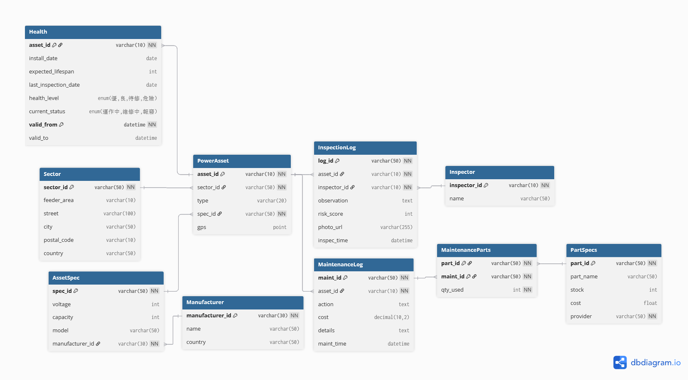

# Team 09 Project - Database Application

This is a PHP-based web application integrated with MariaDB, designed for managing power assets and maintenance logs. The project uses Docker for environment consistency across the team.

## 🚀 Getting Started

### Prerequisites

- [Docker Desktop](https://www.docker.com/products/docker-desktop/) installed and running.
- [Git](https://git-scm.com/) installed.

### Setup Instructions

1. **Clone the repository**

   ```bash
   git clone <your-repository-url>
   cd team09
   ```

2. **Initialize environment variables**
   Copy the example environment file to create your own local `.env`:

   ```bash
   copy .env.example .env
   ```

   *Edit `.env` if you need to change database passwords or names.*

3. **Start the containers**

   ```bash
   docker-compose up -d
   ```

   This will start the PHP application, MariaDB database, and phpMyAdmin.

4. **Import the Database Schema**
   Run the following command to initialize your database structure:

   ```powershell
   Get-Content schema.sql | docker exec -i db09-db mysql -u root -pmyPotato
   ```

   *(Replace `myPotato` with your actual password if you changed it in .env)*

5. **(Optional) Seed Dummy Data**
   To populate your database with demo data, run:

   ```powershell
   Get-Content seed.sql | docker exec -i db09-db mysql -u root -pmyPotato
   ```

## 🛠 Project Structure

- `src/public/`: The web root. Contains `index.php` (Landing Page).
- `src/config/`: Configuration files (Database connections, etc.).
- `schema.sql`: The database structure definition.
- `db_data/`: (Ignored by Git) Local MariaDB data persistence.
- `docker-compose.yml`: Docker service definitions.
- `.env`: (Ignored by Git) Local environment secrets.

## 🔗 Services

| Service | URL | Port |
|---------|-----|------|
| **Web App** | [http://localhost:8080](http://localhost:8080) | 8080 |
| **phpMyAdmin** | [http://localhost:8082](http://localhost:8082) | 8082 |
| **MariaDB** | localhost | 3306 |

## 🧪 Testing Connection

Once the containers are up and the schema is imported, visit [http://localhost:8080](http://localhost:8080). You should see a "Successfully connected to the database!" message in green.

---

## 🗂 Database Structure



The database is centered on `PowerAsset` records and their relationships to inspection, maintenance, and specification data.

- `PowerAsset` links to `Sector` for location details and to `AssetSpec` for equipment specifications.
- `InspectionLog` records inspections and risk scores for each asset, with foreign keys to `PowerAsset` and `Inspector`.
- `Health` stores periodic health snapshots for assets, including status and lifespan tracking.
- `MaintenanceLog` tracks repairs for assets and connects to `MaintenanceParts` for replacement part usage.
- `AssetSpec` is associated with `Manufacturer` metadata.

This structure supports asset tracking, risk-based inspection workflows, maintenance history, and equipment inventory details.

---
**Team 09** - 2026
